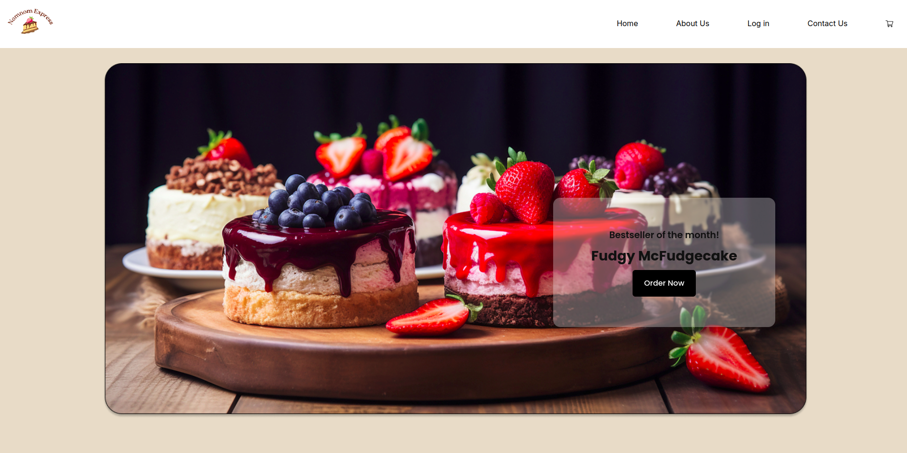
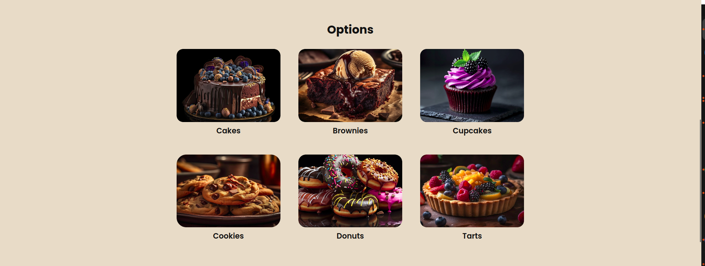
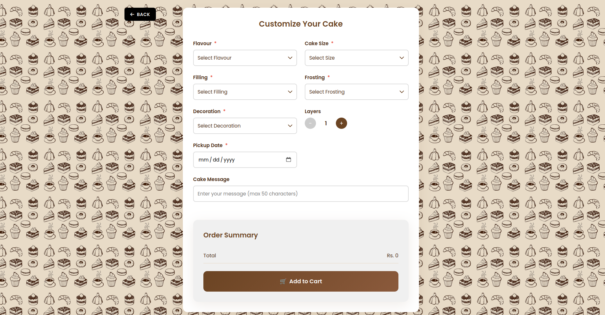
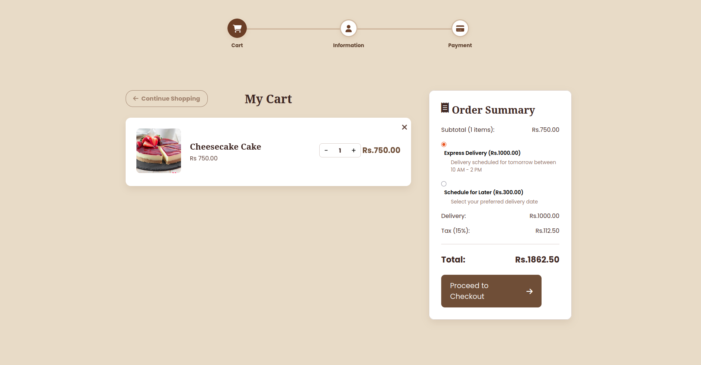
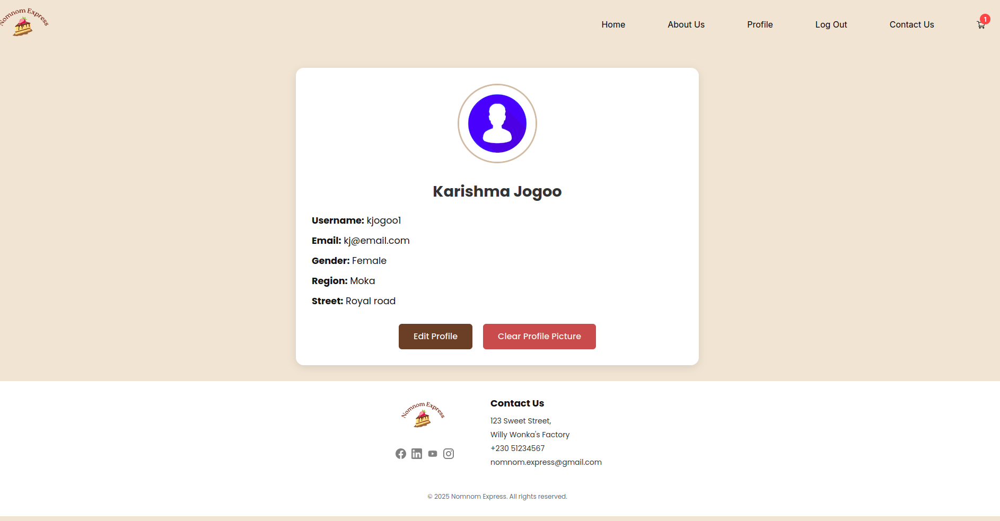

# NomNom Pastry Shop

An e-commerce web application built with Django for a pastry shop. The application allows customers to browse different categories of pastries, customize cakes, add items to their cart, and place orders. The platform also provides user authentication and profile management features.

> [!NOTE]
> Resources used while building and learning:
>
> - Official Django documentation: <https://docs.djangoproject.com/>
> - Django tutorial series and community examples for e-commerce patterns
> - HTML/CSS/JavaScript best practices for responsive UI design
> - All development notes and learning process are documented in `learning.md`

# Features

- Multiple pastry categories (Cakes, Brownies, Donuts, Cookies, Tarts, Cupcakes)
- Custom cake builder with flavors, fillings, frostings, decorations, and sizing options
- User authentication and profile management
- Shopping cart functionality (persistent for authenticated users, session-based for guests)
- Order management system with history tracking
- Responsive web design for desktop and mobile devices
- Admin panel for managing products and orders

# Usage

## Setting Up the Development Environment

1. Clone the repository:

```bash
git clone <repository-url>
```

2. Navigate to the project directory and create a virtual environment:

```bash
cd NomNom
python -m venv venv
```

3. Activate the virtual environment:

- On Linux/Mac:

```bash
source venv/bin/activate
```

- On Windows:

```bash
venv\Scripts\activate
```

4. Install the required dependencies:

```bash
pip install -r requirements.txt
```

5. Create and apply database migrations:

```bash
python manage.py makemigrations
python manage.py migrate
```

6. Populate the database with initial products:

```bash
python sync_products.py
```

7. Create a superuser account:

```bash
python manage.py createsuperuser
```

8. Configure environment variables by creating a `.env` file in the project root with:

```
EMAIL_HOST_USER=your_gmail_address
EMAIL_HOST_PASSWORD=your_gmail_app_password
DEFAULT_FROM_EMAIL=your_gmail_address
```

> Create your 'App Password' using the following link: <https://myaccount.google.com/apppasswords>

9. Load data regarding pastries

```bash
python manage.py loaddata pastry/fixtures/pastries.json
```

10. Start the development server:

```bash
python manage.py runserver
```

The application will be accessible at `http://127.0.0.1:8000/`

## Admin Panel

Access the Django admin panel at `http://127.0.0.1:8000/admin/` using the superuser credentials created in step 7.

## User Registration and Login

New customers can register by clicking on the "Register" link in the navigation bar. Existing users can log in using their credentials.

## Browsing Products

Customers can browse different categories of pastries from the main landing page or through the navigation menu. Each pastry displays its name, price, and image.

## Custom Cake Builder

The cake customization feature allows customers to create personalized cakes by selecting:

- Cake flavor
- Filling options
- Frosting type
- Decorations
- Size and number of layers

## Shopping Cart

Customers can add items to their shopping cart, update quantities, and remove items as needed. The cart item count is displayed across all pages.

## Order Process

After adding items to the cart, customers can proceed to checkout, enter their shipping information, and complete their order.

## Screenshots

### Frontend

- Landing Page:
  

- Pastry Categories:
  

- Custom Cake Builder:
  

- Shopping Cart:
  

- User Profile:
  

# Project Structure

```
NomNom/
├── about_us/           # About us page application
├── cart/               # Shopping cart functionality
├── contact/            # Contact page application
├── landing/            # Main landing page application
├── login/              # User authentication and login application
├── media/              # Uploaded media files (images)
├── NomNom/             # Main Django project settings
├── orders/             # Order management application
├── pastry/             # Pastry catalog and customization
│   ├── fixtures/       # Data fixtures (JSON files)
│   ├── migrations/     # Database migration files
│   ├── static/         # Static files for pastry app
│   ├── templates/      # Templates for pastry app
│   ├── models.py       # Pastry data models
│   └── views.py        # Pastry application views
├── payments/           # Payment processing application
├── profile_page/       # User profile management
├── static/             # Static files (CSS, JS, images)
├── templates/          # Global HTML templates
├── .env                # Environment variables
├── .gitignore          # Git ignore configuration
├── db.sqlite3          # SQLite database
├── manage.py           # Django management script
├── requirements.txt    # Python dependencies
├── sync_products.py    # Script to populate initial products
```

# Technologies Used

- Python
- Django
- HTML5
- CSS3
- JavaScript
- SQLite (default)
- Bootstrap (for responsive design)

# Configuration

The application uses environment variables for sensitive information such as the Django secret key and email settings. These should be set up in a `.env` file in the project root as described in the setup instructions.
